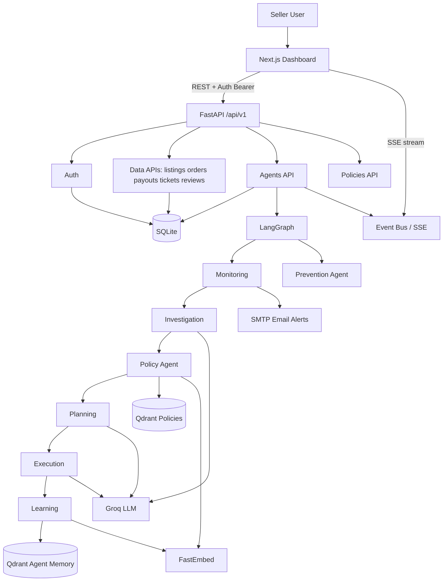

# SellerOps AI — Interview Prep Guide

Use this document to explain the project clearly in interviews.  
Language is kept simple. Structure is designed for easy recall.

---

## 1) One-line summary

**SellerOps AI** is an AI-powered operations assistant for marketplace sellers (Meesho / Amazon / Flipkart). It watches seller data, finds risks early, checks marketplace policies, and helps the seller take the next action — like fixing a listing, writing an appeal, or understanding a payout issue.

---

## 2) Problem statement

Marketplace sellers juggle many things at once:

- Listings and product quality  
- Orders, returns, and cancellations  
- Payouts and deductions  
- Support tickets and bad reviews  
- Long, changing marketplace policies  

**The real problem is not “missing data.”**  
Sellers usually have data. The hard part is:

1. **Noticing problems early** (before account health drops or suspension risk rises)  
2. **Understanding why** the problem happened  
3. **Knowing what to do next** according to marketplace rules  

### Pain points (easy to say in interviews)

| Pain | Why it hurts |
|------|----------------|
| Policy violations noticed too late | Penalties, listing suppression, suspension |
| High return rate / low rating | Account health falls, sales drop |
| Payout mismatches | Money lost, hard to dispute manually |
| Manual monitoring | Slow, error-prone, not scalable |
| Policy docs are huge | Hard to find the exact rule that applies |
| No memory of past fixes | Same issues get re-investigated from scratch |

**Interview-friendly problem line:**

> “Sellers don’t fail because they lack dashboards. They fail because they can’t detect risk early, map it to policy, and act fast.”

---

## 3) Solution approach

SellerOps AI combines:

1. **A seller dashboard** (Next.js) — store health, products, orders/payments, AI diagnosis  
2. **A FastAPI backend** — APIs for data, auth, agents, policies  
3. **A multi-agent AI workflow** (LangGraph) — monitor → investigate → check policy → plan → execute → learn  
4. **RAG over policies** (Qdrant + embeddings + Groq) — answers grounded in real policy text  
5. **Live progress streaming** (SSE) — user sees what the agents are doing in real time  

### Core idea (remember this)

```
Detect → Investigate → Check Policy → Plan → Act → Learn
```

Two main agent modes:

| Mode | Purpose |
|------|---------|
| **Investigation graph** | Find operational issues, root-cause them, draft actions/appeals |
| **Prevention graph** | Scan listings before/while live for missing images, price errors, size charts, etc. |

### What the product can do today

- Login as a seller and see personalized store metrics  
- View listings, orders, payouts, tickets, reviews  
- Run AI diagnosis on real issues or demo **scenarios**  
- Ask policy questions with RAG (Meesho / Amazon / Flipkart docs)  
- Upload / manage products with prevention checks  
- Get **email alerts** for critical issues  
- Store past investigations in **agent memory** so similar cases can reuse results  

---

## 4) Impact

### Business impact

- Faster issue detection (rules + AI, not only manual review)  
- Better policy compliance (answers tied to retrieved policy chunks)  
- Less manual ops effort (appeal drafts, action plans generated)  
- Early warning for account risk (returns, rating, payouts, violations)  
- More consistent decisions (same agent workflow every time)  

### Engineering impact

- Clear layers: UI → API → agents → data/RAG  
- Easy to add new agents or checks  
- Real-time UX via SSE  
- Demo-ready with seed data + scenarios, but structured for real marketplace APIs later  

### Impact line for interviews

> “We reduce the time from ‘something looks wrong’ to ‘here is the root cause, the policy rule, and the next action.’”

---

## 5) 60-second answer (memorize this)

SellerOps AI is an AI operations assistant for e-commerce sellers. Sellers struggle to track listings, returns, payouts, and marketplace policies at the same time, so issues are often caught too late. Our solution is a Next.js dashboard plus a FastAPI backend with a LangGraph multi-agent pipeline. The system monitors seller health, investigates root causes with Groq, retrieves relevant policy text from Qdrant using RAG, then plans and drafts actions like appeal letters. Progress streams to the UI over SSE. We also added login, SQLite persistence, product prevention checks, email alerts, and demo scenarios. The value is faster detection, better compliance, and less manual ops work.

---

## 6) 3-minute answer (use this for deeper rounds)

**Problem.**  
Marketplace sellers manage many moving parts — products, orders, returns, payouts, tickets, and long policy documents. Small signals like a rising return rate or a payout deduction can become account health problems or suspension risk if nobody notices early. Manual monitoring does not scale.

**Solution.**  
SellerOps AI is a full-stack prototype of an autonomous seller ops assistant.

- The **frontend** is a Next.js App Router dashboard with pages for My Store, AI Diagnosis, Products, Orders & Payments, Scenarios, and Marketplace Rules.  
- The **backend** is FastAPI with versioned APIs (`/api/v1`) for auth, listings, orders, payouts, policies, reviews, tickets, chats, scenarios, and agents.  
- Seller data lives in **SQLite** via SQLAlchemy async (seeded from mock JSON for demos).  
- The AI brain is **LangGraph**:  
  - **Monitoring** detects anomalies with thresholds (return rate, rating, payout anomalies) or scenario triggers.  
  - **Investigation** uses Groq (Llama) for root-cause analysis.  
  - **Policy** retrieves relevant rules from Qdrant.  
  - **Planning / Execution** create action plans and seller-ready appeal text.  
  - **Learning** stores successful cases into agent memory for reuse.  
  - A separate **Prevention** agent checks listings for quality issues.  
- Users see agent steps live through **SSE**. Critical issues can trigger **SMTP email alerts**.

**Why this design.**  
We did not put everything in one giant LLM prompt. A graph gives control, debuggability, and clear stages. RAG reduces hallucination on policy questions. Mock/seed data keeps demos reliable while the architecture stays ready for real marketplace APIs.

**Impact.**  
Sellers get one place to see risk, understand “why,” map it to policy, and get a concrete next action — faster and more consistently than manual ops.

---

## 7) Step-by-step workflow (what happens when a user uses it)

### A. Login flow

1. User opens `/login` and enters email + password.  
2. Frontend calls `POST /api/v1/auth/login`.  
3. Backend checks `User` in SQLite and returns a token (demo: token = email), seller id, name, marketplace, tier.  
4. Frontend stores token in `localStorage` and attaches `Authorization: Bearer <token>` on later API calls.  
5. Dashboard loads seller-specific metrics.

### B. Command center (My Store)

1. Dashboard fetches seller metrics, active listings count, payout anomalies, open tickets, recent agent runs.  
2. UI highlights risks (low rating, high returns, violations, payout issues).  
3. User can open an issue and jump into diagnosis / a related scenario.

### C. AI investigation run

1. User starts a run from Investigations / Scenarios / Agents.  
2. Frontend calls `POST /api/v1/agents/run`.  
3. Backend creates an `AgentRun` row, returns `run_id`, starts a **background task**.  
4. Frontend opens an **SSE** stream for that `run_id`.  
5. LangGraph investigation pipeline runs:

```
START
  → Monitoring
      → (if issues) Investigation
          → Policy (RAG)
              → (if escalate) Planning → Execution → Learning → END
              → (else) Learning → END
      → (if no issues) END
```

6. Each agent emits step events → Event Bus → SSE → UI timeline.  
7. Final state is saved to DB; investigation record may be created.  
8. If severity is critical, monitoring can trigger an alert email.

### D. Prevention / product checks

1. User works on listings (view / upload / edit).  
2. Prevention agent scans images, price vs MRP, size charts, description length, guideline-style image issues.  
3. Optional OCR (PaddleOCR) can extract text from images when available; otherwise the system degrades gracefully.

### E. Policy Q&A

1. User asks a policy question on Marketplace Rules.  
2. Backend embeds the query → searches Qdrant policy collection → sends top chunks + question to Groq.  
3. Answer is grounded in retrieved policy text (Meesho / Amazon / Flipkart).

### F. Scenarios (demo / interview gold)

1. Predefined situations like “high return rate,” “counterfeit suspicion,” “payout dispute.”  
2. Monitoring uses scenario expected issues instead of only live metrics.  
3. Makes demos predictable and impressive in interviews.

---

## 8) System architecture

### Layers (say “5 layers”)

| Layer | What | Tech |
|-------|------|------|
| 1. Frontend | Dashboard, login, live agent UI | Next.js, React, Tailwind, Zustand, React Query, Axios |
| 2. API | REST + SSE | FastAPI, Pydantic, Uvicorn |
| 3. Agents | Multi-step AI workflow | LangGraph agents + shared `AgentState` |
| 4. Data | Seller ops data + users | SQLite + SQLAlchemy async + seed scripts |
| 5. Knowledge / AI | Policy RAG + LLM + memory | Qdrant, FastEmbed, Groq, Event Bus / SSE |

### Architecture diagram



### Key backend modules (good to remember)

| Path | Role |
|------|------|
| `backend/main.py` | App factory, CORS, lifespan, error handler |
| `backend/api/v1/*` | Route modules |
| `backend/agents/graph.py` | Investigation + prevention graphs |
| `backend/agents/*_agent.py` | One job per agent |
| `backend/rag/*` | Embedder, indexer, retriever |
| `backend/services/*` | Data, Groq, Qdrant, OCR, event bus |
| `backend/models/*` | SQLAlchemy models + Pydantic schemas |
| `backend/seed.py` | Seeds DB from mock JSON |
| `data/policies/*.txt` | Marketplace policy source docs |
| `data/mock/*.json` | Demo seller data + scenarios |

### Frontend pages

| Route | Name in UI | Purpose |
|-------|------------|---------|
| `/login` | Login | Auth |
| `/` | My Store | Command center / health |
| `/investigations` | AI Diagnosis | Run/view investigations |
| `/listings` | My Products | Products + prevention |
| `/operations` | Orders & Payments | Orders / payouts ops |
| `/scenarios` | Try a Situation | Demo scenarios |
| `/policies` | Marketplace Rules | Policy RAG Q&A |

---

## 9) Technology choices — why + alternatives

### Next.js (App Router) + React + Tailwind

**Why:** Modern dashboard UX, clean routing/layouts, fast iteration, good TypeScript DX.  
**Alternatives:** React + Vite SPA, Remix, Angular.

### FastAPI + Uvicorn + Pydantic

**Why:** Fast Python APIs, async-friendly, excellent validation, natural fit for AI services and SSE.  
**Alternatives:** Flask (simpler/smaller), Django (heavier full-stack), NestJS if fully JS stack.

### LangGraph

**Why:** Multi-step, conditional workflows need structure. Explicit nodes/edges are easier to debug than one mega-prompt.  
**Alternatives:** Plain LangChain chains, custom state machine, Temporal/Prefect for heavy production orchestration.

### Groq (Llama 3.3 70B + lighter 8B)

**Why:** Very low latency for interactive ops UX; light model used for cheaper summarization tasks.  
**Alternatives:** OpenAI, Anthropic, Gemini, self-hosted open models.

### Qdrant

**Why:** Vector DB for policy RAG and agent memory; filter by marketplace.  
**Alternatives:** Pinecone, Weaviate, pgvector, Elasticsearch vectors.

### FastEmbed (ONNX) — `all-MiniLM-L6-v2`

**Why:** Lighter/faster than heavy SentenceTransformers for deploy; 384-dim embeddings match collection config.  
**Alternatives:** SentenceTransformers, OpenAI embeddings, Cohere embeddings.  
**Note:** We switched from SentenceTransformers → FastEmbed after deploy/runtime issues (see Bugs section).

### SQLite + SQLAlchemy async (aiosqlite)

**Why:** Zero-ops DB for prototype; easy seeding; enough for demo concurrency with WAL.  
**Alternatives:** PostgreSQL (production default), MySQL.  
**Honest take:** SQLite is great for demo; Postgres is the right production upgrade.

### SSE (Server-Sent Events)

**Why:** Simple one-way live updates for agent progress.  
**Alternatives:** WebSockets (two-way), polling (simpler but laggy).

### Zustand + React Query + Axios

**Why:** Light client state + server cache + clean HTTP layer with auth interceptor.  
**Alternatives:** Redux Toolkit, SWR, fetch wrappers.

### SMTP email alerts

**Why:** Critical issues should reach the seller even if they are not on the dashboard.  
**Alternatives:** SendGrid/SES, Slack/WhatsApp webhooks.

### PaddleOCR (optional)

**Why:** Extract text from listing images to catch mismatches; optional so deploys don’t break if OCR isn’t installed.  
**Alternatives:** Tesseract, cloud Vision APIs.

---

## 10) Your likely contributions (how to talk about ownership)

Be honest about what you personally built. Based on the repo and commit history, strong claimable areas include:

- Built / extended the **FastAPI backend** and `/api/v1` routers  
- Designed **LangGraph** investigation + prevention workflows  
- Implemented agents: monitoring, investigation, policy, planning, execution, learning, prevention  
- Built **RAG** pipeline (embed → Qdrant → retrieve → Groq answer)  
- Added **auth + login UI** and seller-scoped data access  
- Migrated from mock/in-memory toward **SQLite persistence + seeding**  
- Built dashboard pages (store health, listings, investigations, policies, scenarios)  
- Wired **SSE** streaming for live agent steps  
- Added **email alert** notifications for critical issues  
- Added **product upload / prevention checks**  
- Debugged **deployment, concurrency, and embedding** issues (see below)  

**Safe interview phrasing:**

> “I owned the backend APIs and agent orchestration, and I also worked on connecting the dashboard so sellers can see live investigation progress. I also handled several production-style bugs around SQLite concurrency, async embeddings, and email personalization.”

Adjust this to match your real split with teammates.

---

## 11) Bugs we hit and how we fixed them (very useful in interviews)

Interviewers love “what went wrong.” Use these stories.

### Bug 1 — SQLite locking / concurrency during agent runs

**Symptom:** Agent runs failed or DB errors when graph execution held a long DB session open while the LLM/RAG work ran.  
**Cause:** Long-lived SQLAlchemy session around slow graph work; SQLite does not like concurrent writers.  
**Fix:**
- Run graph **outside** DB session blocks  
- Use **short-lived sessions** for: set status → run graph → save results  
- Enable SQLite **WAL mode** + `synchronous=NORMAL`  
**Commit idea:** “Fix SQLite concurrency and async embedding blocking”

**Interview line:**

> “We were holding DB connections open during LLM calls. I split DB writes into short sessions and turned on WAL so concurrent agent runs stopped colliding.”

### Bug 2 — Embedding calls blocked the async event loop

**Symptom:** API felt stuck / timeouts while embedding text.  
**Cause:** CPU-heavy embedding ran directly inside async request path.  
**Fix:** Wrap model load + embed in `asyncio.to_thread(...)`.  
**Later improvement:** Switched SentenceTransformers → **FastEmbed (ONNX)** for lighter deploys.

**Interview line:**

> “Embedding is CPU-bound. Running it inline blocked FastAPI’s event loop, so I offloaded it to a thread and later moved to FastEmbed for faster, lighter inference.”

### Bug 3 — Deployment / dependency / Python version issues

**Symptom:** Deploy failed on Render (and similar) due to heavy deps / wrong Python.  
**Fixes reflected in history:**
- Pin / clean `requirements.txt`  
- Force **Python 3.11**  
- Add logging for startup debugging  
- Reduce heavy ML deps where possible  

**Interview line:**

> “Prototype deps that work locally can break in cloud builds. We cleaned requirements, locked Python 3.11, and replaced heavier embedding stacks.”

### Bug 4 — Email alerts not personalized / config mismatches

**Symptom:** Alerts went to wrong place or used generic seller details.  
**Fix:** Look up seller + user email from DB by `seller_id`; map SMTP settings via env aliases (`SMTP_FROM`, `ALERT_EMAIL`); improve login UX alongside email fix.  
**Commit idea:** “Email Fix”

### Bug 5 — Auth + data isolation migration

**Symptom:** Early prototype was not truly multi-seller; mock JSON was global.  
**Fix:** Added User/Seller models, login token flow, seller_id scoping on APIs, seed multiple demo sellers (e.g. Rohan / Priya / ElectroKart style accounts).

### Bug 6 — Product upload / UI consistency bugs

**Symptom:** Listings UX and investigation pages had bugs while adding upload + prevention.  
**Fix:** Iterative UI fixes plus prevention agent checks (images, MRP, size charts, description).

### Bug 7 — OCR dependency too heavy

**Symptom:** PaddleOCR may fail to import in some environments.  
**Fix:** Soft dependency — log warning and skip OCR features instead of crashing the app.

---

## 12) Key challenges, limitations, and trade-offs

### Challenges

1. **Turning raw seller data into useful signals**  
   Thresholds are simple and explainable, but not as smart as learned anomaly models.

2. **Keeping AI predictable**  
   Multi-agent graph adds control, but also more moving parts and failure points.

3. **Grounding answers in policy**  
   RAG helps, but bad chunks ⇒ weak answers. Retrieval quality matters as much as the LLM.

4. **Real-time UX**  
   SSE is great for progress, but one-way only; reconnect/history needs care.

5. **Prototype vs production**  
   Seeded SQLite + demo auth is perfect for hackathon/demo, not for real multi-tenant SaaS yet.

### Limitations (be honest)

- Not fully connected to live Meesho/Amazon/Flipkart seller APIs (uses seeded/mock-style data)  
- Auth is demo-grade (token ≈ email; passwords stored simply — not production security)  
- SQLite is not ideal for high multi-user write load  
- Some image “AI checks” are rule/hash-simulated for demo reliability  
- External dependency on Groq + Qdrant availability  
- Agent memory helps similar cases, but evaluation/metrics are still early  

### Trade-offs

| Choice | Gain | Cost |
|--------|------|------|
| LangGraph multi-agent | Control, clarity | More complexity than one prompt |
| RAG for policies | Less hallucination | Needs good chunking/indexing |
| SQLite | Fast to ship | Weaker concurrency vs Postgres |
| SSE | Simple live updates | Not bidirectional |
| Seeded scenarios | Great demos | Not the same as live marketplace chaos |
| FastEmbed | Lighter deploy | May need re-index if vector dims/models change |
| Demo auth | Ships login UX quickly | Must be replaced with JWT/OAuth + hashed passwords |

---

## 13) Realistic improvements / future scope

Prioritize like a product engineer:

### High business value

1. Real marketplace API connectors (orders, listings, payouts webhooks)  
2. Proper auth (JWT/OAuth2, password hashing, RBAC)  
3. Human-in-the-loop approval before sending appeals / making account changes  
4. Slack / WhatsApp / email escalation with richer workflows  

### High engineering value

5. Move DB to **PostgreSQL** (+ maybe Redis for queues/events)  
6. Persist SSE/run history durably; support reconnect  
7. Agent evaluation harness (accuracy, groundedness, latency, cost)  
8. Better chunking + hybrid search (keyword + vector) for policies  
9. Replace simulated image checks with real CV models where needed  
10. Observability: OpenTelemetry traces per agent node  

### Nice product expansions

11. Pricing / inventory / ads agents  
12. Trend dashboards over time (not only current snapshot)  
13. Multi-marketplace unified inbox for tickets + chats  
14. Auto-generated weekly seller health report  

---

## 14) Easy memory aids

### 5-stage pipeline

**Monitor → Investigate → Policy → Plan → Execute** (+ Learn)

### One-sentence pitch

> SellerOps AI helps sellers catch problems early, understand marketplace rules, and respond faster with AI.

### Architecture in one breath

> Next.js UI, FastAPI APIs, LangGraph agents, SQLite data, Qdrant RAG, Groq generation, SSE live updates.

### Demo path (if asked to walk through)

Login → My Store risks → Run scenario → Watch SSE steps → See appeal/action plan → Ask a policy question → Mention email alert + memory reuse.

---

## 15) Common interview questions + strong answers + follow-ups

### Q1. What problem does this project solve?

**Answer:**  
It helps marketplace sellers detect operational risks early — like high returns, low ratings, payout anomalies, and policy violations — then explains the root cause and suggests the next action using a policy-aware AI workflow.

**Follow-ups:**
- How do you detect issues without an LLM?  
- Which issue types matter most for account health?

---

### Q2. Why LangGraph instead of one big prompt?

**Answer:**  
Because seller ops is a pipeline with conditions. Sometimes there are no issues. Sometimes you need policy context. Sometimes you escalate to planning and appeal generation. LangGraph makes those stages explicit, testable, and easier to debug than one uncontrolled prompt.

**Follow-ups:**
- How do conditional edges work in your graph?  
- What state do you pass between nodes?

---

### Q3. How does RAG work in your project?

**Answer:**  
We index marketplace policy text into Qdrant using embeddings. At query time we embed the question or issue types, retrieve top relevant chunks (optionally filtered by marketplace), and pass that context to Groq so answers are grounded in real policy language.

**Follow-ups:**
- How do you chunk documents?  
- What if retrieval returns irrelevant chunks?  
- Why Qdrant over pgvector?

---

### Q4. Why FastAPI?

**Answer:**  
We needed async APIs, strong request/response validation, and easy SSE streaming next to Python AI libraries. FastAPI fits that better than a classic sync Flask app for this use case.

**Follow-ups:**
- How do background agent runs work?  
- How do you handle errors globally?

---

### Q5. Why Groq?

**Answer:**  
Latency. The dashboard is interactive — sellers watch agent steps live — so fast inference matters. We also use a lighter model for cheaper summarization tasks.

**Follow-ups:**
- How do you control cost?  
- How do you reduce hallucinations?

---

### Q6. How does the frontend get live updates?

**Answer:**  
Each agent run has a `run_id`. Agents push events into an in-memory Event Bus queue. The frontend opens an SSE connection to stream those events and render a live timeline.

**Follow-ups:**
- Why not WebSockets?  
- What happens if the client disconnects?  
- Are events persisted?

---

### Q7. Walk me through an investigation end-to-end.

**Answer:**  
User triggers a run → API creates `AgentRun` → background task starts LangGraph → Monitoring finds issues (or loads a scenario) → Investigation asks Groq for root cause → Policy retrieves rules from Qdrant → if escalation needed, Planning + Execution draft actions/appeal → Learning stores memory → UI receives SSE events throughout → result saved in SQLite.

**Follow-ups:**
- Where can this pipeline fail?  
- How do you show failures in UI?

---

### Q8. What did you personally build?

**Answer (customize):**  
I worked on the backend APIs and LangGraph agent orchestration, connected the dashboard to live status via SSE, and fixed several reliability issues — especially SQLite concurrency during agent runs, async embedding blocking, and email alert personalization. I also helped with auth migration and listing prevention checks.

**Follow-ups:**
- Hardest bug you fixed?  
- What would you rewrite now?

---

### Q9. What was the hardest technical challenge?

**Answer:**  
Making the AI path reliable under real async/DB constraints. LLMs and embeddings are slow/CPU-heavy; if you keep DB sessions open or block the event loop, demos break. We had to redesign session lifetime and offload embeddings.

**Follow-ups:**
- How did you verify the fix?  
- Would Postgres remove the problem completely?

---

### Q10. How is auth implemented? Is it production-ready?

**Answer:**  
For the prototype, login validates email/password against SQLite and returns a bearer token (demo token is the email). The frontend stores it and sends it on requests; APIs resolve the seller from that token. It is **not** production-ready — we would move to hashed passwords, JWT/OAuth, refresh tokens, and proper session security.

**Follow-ups:**
- How do you scope data per seller?  
- What are the security risks of the current design?

---

### Q11. Why SQLite? When would you switch?

**Answer:**  
SQLite made local demos and seeding simple. With WAL it handled our prototype concurrency better. For real multi-tenant production traffic, I’d switch to PostgreSQL and likely add a queue worker for agent jobs.

**Follow-ups:**
- What concurrency issues did you see?  
- How does WAL help?

---

### Q12. What is the Prevention agent?

**Answer:**  
It’s a listing-quality gate. It checks missing/low image counts, price vs MRP, missing size charts for apparel, weak descriptions, and guideline-style image issues. Goal: catch problems before they become return-rate or suppression problems.

**Follow-ups:**
- Which checks are rules vs ML?  
- How does OCR fit in?

---

### Q13. How do scenarios help?

**Answer:**  
Scenarios are curated incident packs — high returns, counterfeit suspicion, payout disputes, etc. They make demos predictable and help us test the full agent path without waiting for rare live failures.

**Follow-ups:**
- How is a scenario different from normal monitoring?  
- How many scenarios do you support?

---

### Q14. How do you stop the system from hallucinating policy advice?

**Answer:**  
We retrieve policy chunks first and generate from that context. We also keep agent roles narrow (policy agent retrieves; planning/execution consume context). Still, retrieval mistakes can happen — so production needs citation UI, confidence, and human approval for high-risk actions.

**Follow-ups:**
- Do you show source chunks in UI?  
- How would you evaluate groundedness?

---

### Q15. What are the biggest trade-offs in your design?

**Answer:**  
Control vs complexity (multi-agent graph), speed of demo vs production realism (seeded data + demo auth), and simplicity of SSE vs richer realtime infrastructure. We optimized for a credible, explainable prototype that can evolve into production.

**Follow-ups:**
- What would you change first for production?  
- What did you intentionally not build?

---

### Q16. How would you scale this?

**Answer:**  
Postgres + managed vector DB, separate worker processes for agent graphs, Redis/queue for jobs, CDN/frontend on Vercel-style hosting, backend autoscaling, caching for repeated policy queries, and rate limits per seller. Add observability per agent node for latency/cost.

**Follow-ups:**
- Where are the bottlenecks today?  
- How do you handle bursty agent runs?

---

### Q17. Tell me about a bug you fixed.

**Pick one story (recommended: SQLite concurrency):**  
While running agents, we kept a DB session open for the whole graph. LLM calls are slow, so SQLite lock/concurrency errors appeared and runs failed to save cleanly. I changed the flow to short DB sessions around status updates and final writes only, enabled WAL mode, and also moved embedding work off the event loop with `asyncio.to_thread`. After that, runs completed and persisted reliably.

**Follow-ups:**
- How did you reproduce it?  
- Any remaining risks?

---

### Q18. Why not fully autonomous actions?

**Answer:**  
Seller account actions can be high risk — wrong appeal or wrong listing change can hurt trust. Our execution step currently generates recommended communications/actions. For production I’d add human approval for irreversible steps.

**Follow-ups:**
- Which actions are safe to auto-run?  
- How would approval UX work?

---

### Q19. How does learning / memory work?

**Answer:**  
After a successful investigation + generated output, the Learning agent embeds a memory document into Qdrant. Later similar cases can retrieve that memory and skip redundant work — faster and more consistent responses.

**Follow-ups:**
- How do you avoid storing bad memories?  
- How do you measure memory hit quality?

---

### Q20. What is your closing pitch?

**Answer:**  
SellerOps AI turns noisy seller operations data into a guided loop: detect risk, explain cause, check policy, and draft the next action — with a transparent multi-agent workflow sellers can actually trust and follow.

---

## 16) Quick cheat sheet (last-minute revision)

| Topic | Say this |
|-------|----------|
| Problem | Sellers catch ops/policy issues too late |
| Solution | Dashboard + FastAPI + LangGraph agents + RAG |
| Pipeline | Monitor → Investigate → Policy → Plan → Execute → Learn |
| Live UX | SSE event stream per run |
| Data | SQLite seeded seller data + policy text files |
| AI | Groq for generation, FastEmbed + Qdrant for retrieval/memory |
| Extra | Auth, prevention checks, scenarios, email alerts |
| Biggest bug | SQLite session lifetime + blocking embeddings |
| Limitation | Demo data/auth; not full live marketplace integration yet |
| Next step | Real APIs + Postgres + JWT + human approval |

---

## 17) Good closing line

> I built a seller operations assistant that combines real-time monitoring, multi-agent investigation, and policy-aware RAG so marketplace sellers can detect risk earlier and act with clearer next steps.
