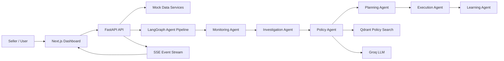

# SellerOps AI Interview Prep

Use this as a simple way to explain the project in interviews. The goal is to sound clear, confident, and practical.

## 1) One-line summary

SellerOps AI is an AI-powered operations assistant for e-commerce sellers. It watches seller data, finds problems like risky listings, returns, or payout anomalies, checks marketplace policies, and suggests or triggers the next best action.

## 2) Problem statement

Marketplace sellers often manage many things at once: listings, orders, returns, payouts, and policy compliance. The hard part is not collecting the data. The hard part is noticing issues early and deciding what action to take.

Common pain points:

- Sellers miss policy violations until they get penalized.
- Return spikes and payout mismatches are noticed too late.
- Manual monitoring takes time and is easy to get wrong.
- Policy documents are long, so finding the right rule is slow.
- Teams need a system that can monitor, explain, and respond faster than manual review.

## 3) Solution approach

SellerOps AI solves this by combining a dashboard, APIs, and AI agents.

What it does:

- Reads seller data from the backend.
- Monitors health signals like returns, ratings, active listings, and payout anomalies.
- Uses a graph of AI agents to inspect issues step by step.
- Retrieves policy context from a searchable knowledge store.
- Generates a response or action plan.
- Streams progress back to the frontend in real time.

Simple idea:

1. Detect the issue.
2. Investigate the cause.
3. Check policy rules.
4. Decide what to do.
5. Learn from the outcome.

## 4) Impact

Business impact:

- Faster issue detection.
- Lower manual effort for seller operations teams.
- Better policy compliance.
- Early warning for risky listings or payout problems.
- More consistent decisions because the system follows the same workflow each time.

Engineering impact:

- Clear separation between API, agent logic, data, and UI.
- Easy to add more checks or agents later.
- Real-time updates through SSE make the experience feel responsive.

## 5) 60-second answer

SellerOps AI is an operations assistant for marketplace sellers. The problem is that sellers have to track listings, orders, returns, payouts, and policy changes manually, and issues often get noticed too late. This system solves that by combining a FastAPI backend, a Next.js dashboard, and a LangGraph-based agent workflow. The backend loads seller data, checks for issues, and exposes APIs for listings, orders, payouts, policies, and agent runs. The agent graph moves through monitoring, investigation, policy lookup, planning, execution, and learning. For policy questions, it uses RAG with Qdrant and Groq to find relevant policy content and generate helpful answers. The frontend shows seller health metrics, issues, and agent activity in a simple dashboard. The main value is faster monitoring, better compliance, and less manual work.

## 6) 2-minute answer

SellerOps AI is built to help e-commerce sellers manage day-to-day operations more intelligently. Sellers usually have to watch a lot of moving parts at the same time: active listings, order health, return rate, payouts, and marketplace policies. The problem is that small issues can turn into costly problems if they are not caught early.

The project solves this with a layered system. The FastAPI backend acts as the main service layer and exposes endpoints for health, listings, orders, payouts, policies, and agents. The frontend is a Next.js dashboard that shows the seller’s current status, alerts, and issue summary. Under the hood, the AI part is organized as a LangGraph pipeline, so the system can move through monitoring, investigation, policy checking, planning, execution, and learning in a controlled way instead of doing one big LLM call.

For policy-related questions, the backend uses retrieval from Qdrant and generation through Groq. That means the system can search policy documents first and then produce a grounded answer. It also streams agent progress back to the UI using SSE, so the user can see what is happening in real time.

Overall, the project is useful because it reduces manual monitoring, gives faster insight into risks, and makes seller operations more proactive.

## 7) Step-by-step workflow

Here is the easiest way to explain the flow:

1. The dashboard loads seller metrics.
2. The frontend calls backend APIs for seller data, listings, and payout anomalies.
3. The backend reads mock data now, but the structure is ready for real marketplace integrations later.
4. The dashboard highlights risks such as low rating, high return rate, or payout issues.
5. If an agent run is started, the backend creates a run ID and sends the task to the LangGraph pipeline.
6. The graph starts with monitoring.
7. If an issue is found, it moves to investigation.
8. The policy agent checks relevant marketplace rules.
9. If escalation is needed, the planning agent creates an action plan.
10. The execution agent carries out the next step.
11. The learning agent stores the result so future runs can improve.
12. The frontend listens to SSE events and shows progress in real time.

## 8) System architecture

Think of the architecture in 5 layers.

### A. Frontend layer

- Next.js App Router for the dashboard.
- React client components for live data and interaction.
- UI components for cards, badges, status dots, and loading states.

### B. API layer

- FastAPI serves all backend routes.
- API versioning is used through `/api/v1`.
- Separate routers exist for agents, listings, orders, payouts, policies, and health.

### C. Agent orchestration layer

- LangGraph controls the agent flow.
- Each agent handles one job.
- The graph decides the next step based on state.

### D. Data and knowledge layer

- Mock JSON data is used for listings, orders, payouts, and seller metrics.
- Policy documents are stored as text files.
- Qdrant is used for vector search over policy content.

### E. AI and event layer

- Groq is used for fast LLM responses.
- SSE is used to stream agent events to the UI.
- A simple event bus connects backend runs to live updates.

### Architecture flow

## 9) Why each technology was used

### Next.js

Why:

- Good for modern dashboards.
- App Router makes page and layout structure clean.
- Server and client components help with performance and flexibility.

Possible alternatives:

- React + Vite for a simpler SPA.
- Angular if the team wants a more opinionated framework.

### FastAPI

Why:

- Very fast to build APIs with Python.
- Easy async support.
- Great for AI and data-heavy services.
- Strong request validation with Pydantic.

Possible alternatives:

- Flask for a smaller app.
- Django for a more full-stack monolith.

### LangGraph

Why:

- Good for multi-step AI workflows.
- Makes the agent flow explicit.
- Easier to debug than a single prompt chain.

Possible alternatives:

- LangChain chains and tools.
- Custom workflow engine.
- Temporal or Prefect if the logic becomes more enterprise-grade.

### Groq

Why:

- Very fast LLM inference.
- Useful when low latency matters in an interactive product.

Possible alternatives:

- OpenAI.
- Anthropic.
- Local open-source models if cost control is the main goal.

### Qdrant

Why:

- Good for vector search over policy documents.
- Easy to store and retrieve embeddings.
- Suitable for RAG use cases.

Possible alternatives:

- Pinecone.
- Weaviate.
- Elasticsearch vector search.

### SQLite / SQLAlchemy

Why:

- Simple to start with.
- Enough for a prototype or demo.
- SQLAlchemy gives a clean ORM layer.

Possible alternatives:

- PostgreSQL for production.
- MySQL if existing infra already uses it.

### SSE

Why:

- Simple way to stream backend events to the frontend.
- Good for one-way live updates.

Possible alternatives:

- WebSockets for two-way communication.
- Polling if real-time updates are not important.

### Pydantic

Why:

- Strong validation.
- Clear API contracts.
- Helps keep request and response data clean.

Possible alternatives:

- Marshmallow.
- Manual validation, but that is more error-prone.

## 10) Likely contributions you can claim

Based on the repo structure, these are the most likely areas you worked on:

- Built or helped build the FastAPI backend.
- Designed the API routes for listings, orders, payouts, policies, and agents.
- Created the LangGraph agent workflow.
- Added the monitoring, investigation, policy, planning, execution, and learning agents.
- Built the dashboard shell and overview page in Next.js.
- Connected the frontend to backend services.
- Added SSE-based streaming for live agent progress.
- Set up mock data and policy files for demo and testing.
- Added Qdrant and Groq integration for policy search and LLM output.

If you want, you can say this in a safe way:

- “I worked on the backend APIs and agent orchestration, and also helped wire the dashboard to show live operational status.”

## 11) Key challenges

### 1. Turning raw data into useful signals

Challenge:

- Seller data alone does not tell a story unless it is turned into health metrics and alerts.

Trade-off:

- Simple rules are easy to understand, but they are less flexible.

### 2. Making AI behavior predictable

Challenge:

- A single LLM prompt is hard to control.

Trade-off:

- LangGraph adds structure, but it also adds more moving parts.

### 3. Keeping answers grounded in policy

Challenge:

- LLMs can hallucinate if they answer from memory only.

Trade-off:

- RAG improves accuracy, but retrieval quality becomes important.

### 4. Real-time updates

Challenge:

- Users want to see progress while agents are working.

Trade-off:

- SSE is easy for streaming, but it is one-way only.

### 5. Prototype vs production

Challenge:

- The repo uses mock data and in-memory run storage for now.

Trade-off:

- This makes development faster, but it is not yet production-ready.

## 12) Limitations

- Mock data is used instead of live marketplace integrations.
- Runs are stored in memory, so history is not durable.
- Some flows depend on external services like Groq and Qdrant.
- The system is more of an intelligent operations assistant than a fully autonomous fix-all product.
- Policy answers depend on the quality of indexed documents.

## 13) Future scope

Good improvement ideas:

- Replace mock data with real marketplace APIs.
- Store runs and agent history in a real database.
- Add authentication and role-based access.
- Add alerts by email, Slack, or WhatsApp.
- Add more agents for pricing, inventory, and seller support.
- Add better memory for repeated issue patterns.
- Add evaluation metrics for agent accuracy and response quality.
- Add dashboards for trends over time, not just current status.
- Add human approval for risky actions before execution.

## 14) Common interview questions

### Q1. What problem does this project solve?

Sample answer:

It helps e-commerce sellers monitor operational health in one place. Instead of checking listings, returns, payouts, and policy documents manually, the system detects issues and guides the next action.

Follow-up questions:

- How is the issue detection done?
- What data sources does it use?

### Q2. Why did you use LangGraph?

Sample answer:

I used LangGraph because the workflow is multi-step and conditional. The system should not jump straight to an answer. It should monitor first, investigate if needed, then check policy, plan, execute, and learn.

Follow-up questions:

- Why not use a single agent prompt?
- How do you decide the next node?

### Q3. Why did you use FastAPI?

Sample answer:

FastAPI is a good fit because the project needs clean APIs, async support, and strong validation. It also works well for AI services where multiple requests and streams can happen at the same time.

Follow-up questions:

- How does FastAPI handle async tasks here?
- Why not Flask?

### Q4. What is the role of Qdrant?

Sample answer:

Qdrant stores embeddings of policy content so the system can search policy documents by meaning, not just keyword match. That makes policy answers more relevant.

Follow-up questions:

- How do you chunk policy documents?
- What if retrieval returns the wrong context?

### Q5. Why use Groq?

Sample answer:

Groq gives fast LLM responses, which is useful when the user wants quick operational guidance. Speed matters because the dashboard and agent flow are interactive.

Follow-up questions:

- What would you use if cost mattered more than latency?
- How do you reduce hallucinations?

### Q6. How does the frontend get live updates?

Sample answer:

The backend exposes an SSE stream for each agent run. The frontend listens to that stream and updates the UI as events arrive.

Follow-up questions:

- Why SSE instead of WebSockets?
- What kind of events are streamed?

### Q7. What did you personally work on?

Sample answer:

I worked on the backend APIs and the agent workflow, and I also helped connect the frontend to the live status data. If needed, I can go deeper into the exact pieces I owned.

Follow-up questions:

- Which files or modules did you own?
- What was the hardest part you solved?

### Q8. What is the biggest technical challenge?

Sample answer:

The hardest part is making AI behavior reliable. The system must not just generate text. It has to follow a controlled workflow, use policy context, and return something useful for operations.

Follow-up questions:

- How do you test reliability?
- What fails most often?

### Q9. What are the trade-offs in this design?

Sample answer:

The main trade-off is flexibility versus control. AI makes the system smarter, but a structured graph and strict schemas are needed to keep it predictable.

Follow-up questions:

- What did you sacrifice to keep it predictable?
- What would you change in production?

### Q10. How would you improve it next?

Sample answer:

I would connect real marketplace APIs, store run history in a database, add human approval for risky actions, and build better analytics for trends and repeated issues.

Follow-up questions:

- Which improvement has the highest business value?
- Which one is easiest to ship first?

## 15) Easy memory version

Use this 5-word flow:

Monitor -> Investigate -> Policy -> Plan -> Execute

Use this short product pitch:

SellerOps AI helps sellers catch problems early, understand policy rules, and respond faster with AI.

Use this simple architecture summary:

Next.js UI, FastAPI backend, LangGraph agent flow, Qdrant policy search, Groq for generation, SSE for live updates.

## 16) Good closing line

I built a seller operations assistant that combines real-time monitoring, AI-driven investigation, and policy-aware answers to help sellers act faster and reduce operational risk.